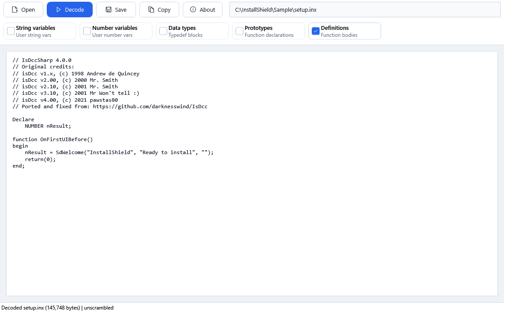

# IsDccSharp

[](https://github.com/pawstas80/IsDccSharp/actions/workflows/build.yml)

IsDccSharp is a C#/.NET Framework 4.8 port of the public `isDcc` InstallShield INX decoder:
https://github.com/darknesswind/IsDcc

It decodes compiled InstallShield `.inx` files into readable script-like text. The project is split into a reusable decoder library, a command-line tool, and a WPF viewer.

## Viewer



## Projects

| Project | Purpose |
| --- | --- |
| `src/IsDccSharp.Core` | Reusable decoder library with sync and async APIs. |
| `src/IsDccSharp.Cli` | Console application: `IsDccSharp.exe`. |
| `src/IsDccSharp.Viewer` | WPF viewer built with MVVM. |

## Build

Requirements:

- Windows
- .NET SDK
- .NET Framework 4.8 reference assemblies

```powershell
dotnet build .\IsDccSharp.sln -c Release
```

CLI output:

```text
src\IsDccSharp.Cli\bin\Release\net48\IsDccSharp.exe
```

WPF viewer output:

```text
src\IsDccSharp.Viewer\bin\Release\net48\IsDccSharp.Viewer.exe
```

## CLI Usage

```powershell
IsDccSharp.exe "C:\path\setup.inx" "C:\path\setup.txt"
```

Without the second argument, decoded text is printed to the console:

```powershell
IsDccSharp.exe "C:\path\setup.inx"
```

## Library Usage

```csharp
using IsDccSharp.Core;

var decoder = new InxDecoder();
DecodeResult result = await decoder.DecodeFileAsync(@"C:\path\setup.inx");

Console.WriteLine(result.Text);
```

The library also exposes `DecodeFile` and `DecodeBytes` for synchronous or in-memory use.

## Credits

This port keeps the original `isDcc` author history:

- `isDcc v1.x`, (c) 1998 Andrew de Quincey
- `isDcc v2.00`, (c) 2000 Mr. Smith
- `isDcc v2.10`, (c) 2001 Mr. Smith
- `isDcc v3.10`, (c) 2001 Mr Won't tell :)
- `isDcc v4.00`, (c) 2021 pawstas80

## Improvements

- Ported the decoder to C# and .NET Framework 4.8.
- Added automatic `aLuZ` detection to avoid double-unscrambling.
- Fixed `goto2` alignment for newer INX files.
- Applied the type `13` correction from `TYPE_AUTOSTRING` to `TYPE_UNDEF5`.
- Added Stirling Technologies info string support as a warning.

References:

- https://github.com/darknesswind/IsDcc

Use only with files you own or are allowed to analyze. Review the original source licensing before selecting a public repository license.
